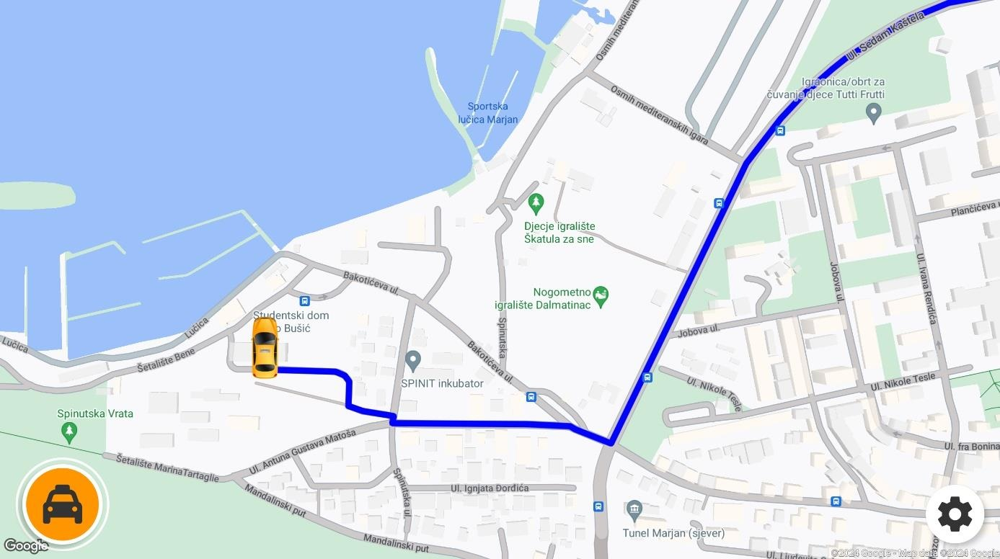
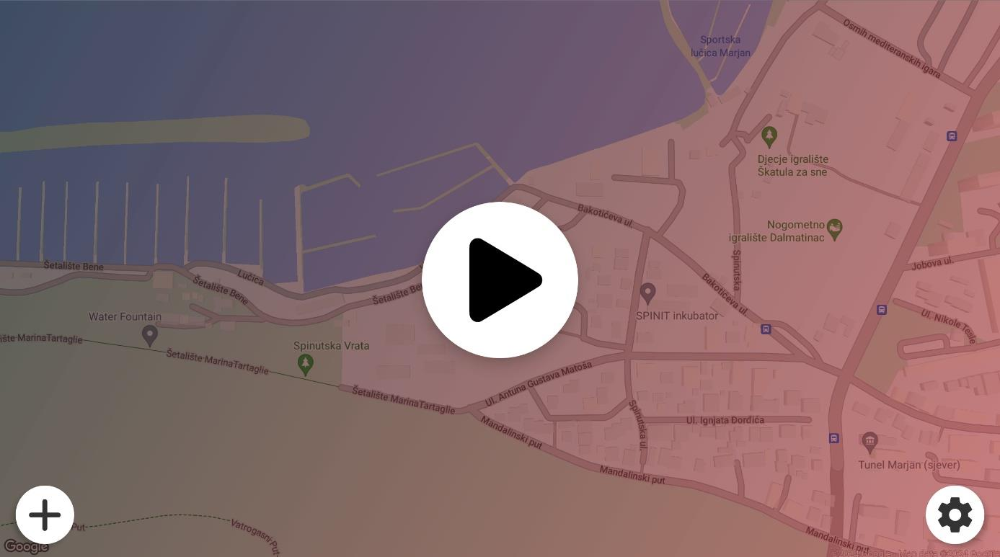
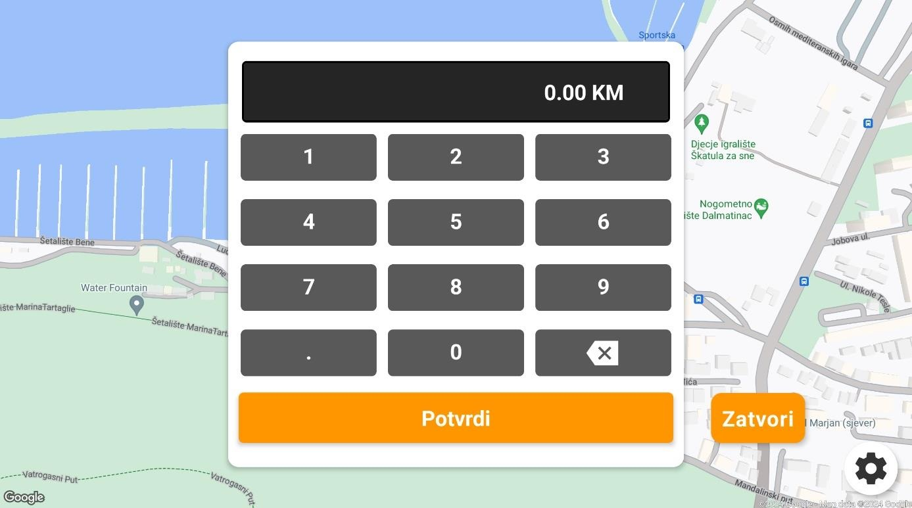
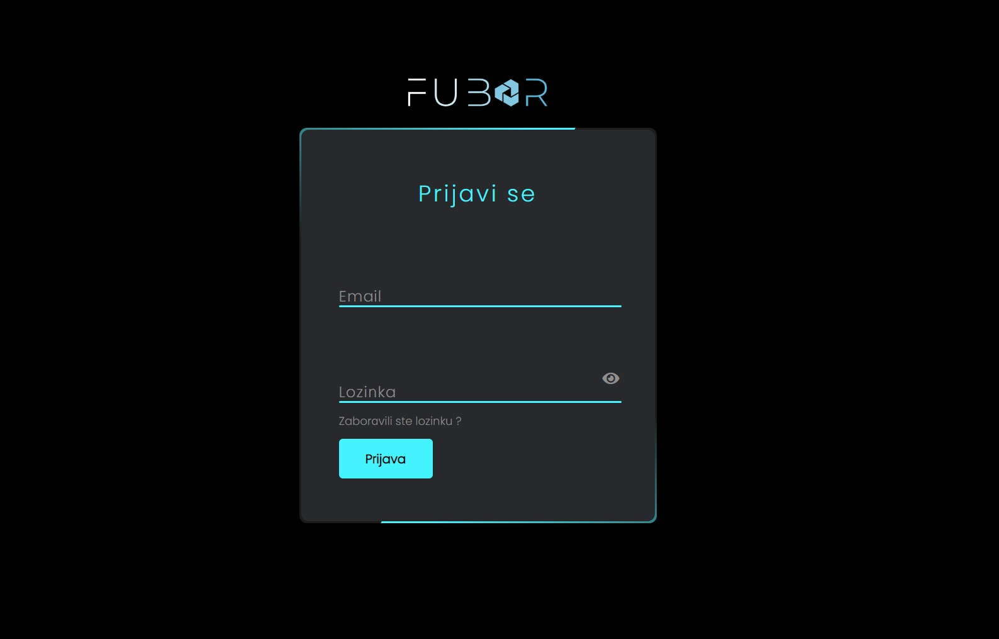
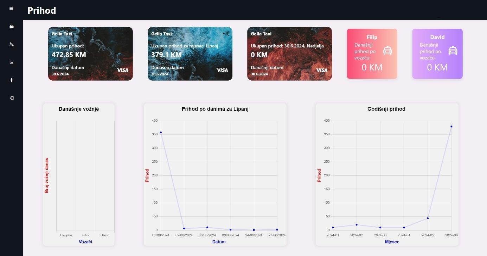

# FUBAR Taxi Dispatch System

## Overview

**FUBAR Taxi** is a comprehensive taxi dispatch system designed to streamline operations for taxi services, particularly in areas where such systems are scarce or underdeveloped. Also some parts of this project are examined as part of a final thesis at the University of Split, Faculty of Electrical Engineering, Mechanical Engineering, and Naval Architecture.

- **Developers:** David Jezidžić, Filip Čalić 

## Project Description

The system consists of:
- **Android Application:** For taxi drivers to view their current location, accept or reject rides, and manage their status (on break, available, or busy).
- **Web Application:** For dispatchers to monitor taxi vehicles in real-time, assign rides, manage drivers, and keep records of all trips.

### Key Features

#### Android Application
- **Location Tracking:** Displays the current location of the taxi vehicle every 3 seconds using Google Maps API with combined usage of GPS and Internet geolocating for greater optimisation and better precision of location.
- **Ride Request Management:** Drivers receive new ride notifications with essential details, including pickup location and optional destination, displayed in a pop-up window. They can promptly accept or reject ride requests. The app also displays the route on the map using Google Directions API after accepting a ride.
- **Driver Status:** Allows drivers to set their status to available, on break, or busy.
- **Customizable Settings:** Change map styles, user names, and other settings for a personalized experience.
- **Dynamic Map Experience:** The map rotates to align with the taxi's direction of travel, and the taxi icon smoothly animates its movement, providing a realistic navigation experience.
- **Sound Notifications for New Rides:**  A repeating chime sound alerts drivers to new ride requests, ensuring prompt awareness even when the screen isn't actively monitored. The sound is managed to avoid overlap if multiple requests arrive simultaneously.
- **Ride Queue Management:**  Implements a ride queue system. If a driver is currently "Busy" with a ride, incoming requests are added to a queue. Once the current ride is completed, the driver is notified of the next waiting ride with a sound effect and a display notification. The function cycles through new rides, adding them to the queue or directly starting the ride. This ensures continuous workflow.

#### Web Application (Dispatcher App)

-   **Real-Time Map View:** Displays the real-time locations and statuses of all taxi vehicles on a dynamic map. Taxi icons change color to indicate their current status (available, busy, on break). A smooth animation has been implemented to prevent abrupt icon movements.
-   **Ride Assignment:** Dispatchers can assign rides to specific drivers, providing details such as pickup location, destination (optional), and a textual description. The description is the only mandatory field in the ride assignment process. The lack of destination field is intended to streamline the process of assigning a new ride request.
-   **Driver Management:** Allows dispatchers to manage driver information, including name, contact details, and vehicle registration.
-   **Ride History and Reporting:** Records detailed information about all completed rides, including timestamps, locations, fares, and driver assignments. Includes an Excel API for graphs and visualization.
-   **Revenue Tracking:** Provides tools for tracking revenue generated by individual drivers and the entire taxi fleet.
-   **Employee Management:** Enables management of employee data, including names, contact information, and taxi registration numbers.
-   **Asynchronous Data Loading:** Implements asynchronous data retrieval from the database to ensure smooth performance and prevent UI blocking.
-   **Intuitive User Interface:** Designed for ease of use, with a clear layout, intuitive controls, and customizable options.

## Technologies Used

- **Android App:** React Native (version 0.70)
- **Web App:** HTML, CSS, Vanilla JavaScript
- **Database:** Firebase (Real-time Database, Authentication, Hosting)
- **APIs:** Google Maps JavaScript API, Google Places API, Google Directions API

## Screenshots

### Android Application

* **Ride navigation:**
  

* **New ride notification:**
  

* **"On break" menu:**

* **Fare input:**

### Web Application
* **Log in Form:**
  

* **Map overview:**
  

* **Ride history:**
  

* **Revenue:**

## Development Process

### Research and Planning

-   Conducted field research by observing taxi services in Vitez, Bosnia and Herzegovina.
-   Identified key issues, including the need for real-time tracking, efficient ride assignment, and data management.
-   Engaged with taxi dispatchers and drivers to understand their specific needs and challenges.  Recognized that dispatchers often don't have a passenger's destination, which is why the destination is optional.
-   Addressed the challenge of GPS accuracy on older devices.
-   Recognized the optional nature of destination information provided by passengers.

### Implementation

-   **Backend:** Utilized Firebase for real-time data synchronization between the Android and web applications, leveraging its cost-effectiveness and scalability. Used separate references in the database to implement the ride queue. This required a function that cyclically reads the new rides and adds them to the queue or starts them directly.
-   **Frontend:** Developed using React Native for Android and vanilla JavaScript, HTML, CSS for the web, ensuring cross-platform compatibility and ease of use. Employed the KeepAwake open-source component to prevent the screen from sleeping. Implemented a "ping" between the app and the dispatcher website to check connectivity.
-   Addressed the challenge of GPS accuracy on older devices.

### Testing

-   Performed extensive testing using emulators and real-world scenarios to ensure functionality and user experience.
-   Addressed issues related to GPS accuracy and signal strength on different devices.
-   Gathered feedback from taxi drivers and dispatchers to refine the application's features and usability. The ability for drivers to change their names in the Android app came from user feedback.
-   Implemented a test function that emulates the movement of the device.

## Future Enhancements
- Implement user-facing applications to reduce the need for dispatchers in areas where such systems are scarce or underdeveloped.
- Enhance security measures and data privacy.
- Optimize location tracking algorithms for better accuracy and resource management.

## Contact

For inquiries or further information, please visit our [website](www.fubartaxi.com) or contact us via [email](fubarsoftware@gmail.com) .

This project is under the copyright of FUBAR. All rights reserved.

